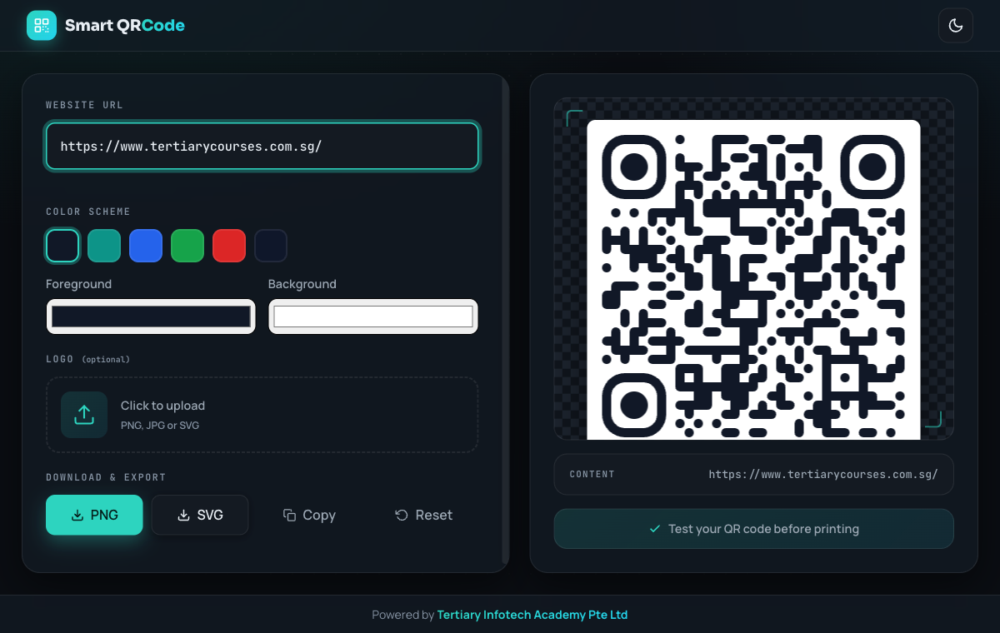

<div align="center">

# Smart QR Code Generator

[](https://alfredang.github.io/qrcodegenerator/)
[](https://developer.mozilla.org/docs/Web/HTML)
[](https://developer.mozilla.org/docs/Web/CSS)
[](https://developer.mozilla.org/docs/Web/JavaScript)
[](https://alfredang.github.io/qrcodegenerator/)

**A lightweight, browser-based QR code generator with a modern dark UI.**

Enter a URL, pick a color scheme, add a logo, and download — all 100% client-side.

[Live Demo](https://alfredang.github.io/qrcodegenerator/) · [Report Bug](https://github.com/alfredang/qrcodegenerator/issues) · [Request Feature](https://github.com/alfredang/qrcodegenerator/issues)

</div>

## Screenshot



## About

Smart QR Code Generator is a focused, single-screen web app for creating clean QR codes fast. There's no backend and no build step — just open it and start typing. Everything runs locally in your browser, so the URL you enter never leaves your device.

The interface is deliberately minimal: a URL field and live preview side by side, fitting in a single viewport.

### Features

| Feature | Description |
|---------|-------------|
| ⚡ **Instant preview** | The QR code updates live as you type, with automatic `https://` prefixing |
| 🎨 **Color schemes** | One-click preset palettes plus custom foreground/background color pickers |
| 🖼️ **Logo upload** | Drop a PNG, JPG or SVG into the center, with adjustable size |
| ⬇️ **PNG & SVG export** | Download a crisp raster PNG or scalable SVG, or copy the image to your clipboard |
| 🌗 **Dark / light theme** | Modern dark theme by default; toggle is persisted in `localStorage` |
| 🔒 **Private & offline** | No server, no tracking — all generation happens in the browser |
| ♿ **Accessible** | WCAG-safe contrast, visible keyboard focus rings, responsive mobile layout |

## Tech Stack

| Category | Technology |
|----------|------------|
| **Markup** | HTML5 |
| **Styling** | CSS3 (custom properties, light/dark theming, dot-grid backdrop) |
| **Logic** | Vanilla JavaScript (ES2015+, no framework) |
| **QR Engine** | [qr-code-styling](https://github.com/kozakdenys/qr-code-styling) |
| **Fonts** | Sora · Manrope · JetBrains Mono (Google Fonts) |
| **Hosting** | GitHub Pages |

## Architecture

```
┌──────────────────────────────────────────────────────────┐
│                        Browser                             │
│                                                            │
│   index.html ── markup & layout (header / app / footer)    │
│        │                                                   │
│        ├── styles.css ── theme tokens, dark/light, layout  │
│        │                                                   │
│        └── app.js ──────────────────────────────────────┐ │
│                 │                                        │ │
│                 ▼                                        │ │
│     ┌───────────────────────┐    ┌────────────────────┐ │ │
│     │  Input + controls      │ →  │  buildOptions()    │ │ │
│     │  url · colors · logo   │    │  (debounced)       │ │ │
│     └───────────────────────┘    └─────────┬──────────┘ │ │
│                                             ▼            │ │
│                                  ┌────────────────────┐  │ │
│                                  │  QRCodeStyling     │  │ │
│                                  │  live <canvas>     │  │ │
│                                  └─────────┬──────────┘  │ │
│                                            ▼             │ │
│                                  PNG / SVG / clipboard   │ │
│                                                          │ │
└──────────────────────────────────────────────────────────┘
                   (no backend — fully client-side)
```

## Project Structure

```
qrcodegenerator/
├── index.html      # Header, URL input, color schemes, logo, preview, footer
├── styles.css      # Dark-first theme tokens, single-viewport layout
├── app.js          # QR generation, color/logo handling, download, theme toggle
├── screenshot.png  # App preview (used in this README)
└── README.md
```

## Getting Started

### Prerequisites

Any modern browser. To use the **Copy to clipboard** feature you'll want to serve over `localhost` or HTTPS (browsers block it on `file://`).

### Run locally

```bash
# Clone the repository
git clone https://github.com/alfredang/qrcodegenerator.git
cd qrcodegenerator

# Serve the folder (any static server works)
python -m http.server 8000
# then open http://localhost:8000
```

Or simply open `index.html` directly in your browser.

## Deployment

This is a static site, so it deploys anywhere that serves files.

**GitHub Pages** (current deployment):

1. Push to the `main` branch.
2. In **Settings → Pages**, set the source to `main` / `/ (root)`.
3. The site goes live at `https://<owner>.github.io/<repo>/`.

Drag-and-drop hosts like **Netlify**, **Vercel**, or **Cloudflare Pages** also work with zero configuration.

## Contributing

Contributions are welcome!

1. Fork the repository
2. Create a feature branch (`git checkout -b feature/amazing-feature`)
3. Commit your changes (`git commit -m 'Add amazing feature'`)
4. Push to the branch (`git push origin feature/amazing-feature`)
5. Open a Pull Request

## Developed By

**Tertiary Infotech Academy Pte Ltd** — [tertiarycourses.com.sg](https://www.tertiarycourses.com.sg/)

## Acknowledgements

- [qr-code-styling](https://github.com/kozakdenys/qr-code-styling) — the QR rendering engine
- [Google Fonts](https://fonts.google.com/) — Sora, Manrope & JetBrains Mono
- Icons hand-built as inline SVG

---

<div align="center">

If you find this useful, please ⭐ the repo!

</div>
